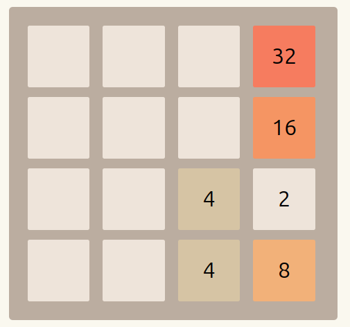

2048 Game

## 📚 Table of Contents

1. [Introduction](#1-introduction)  
   1.1 [System Overview](#11-system-overview)

2. [Technical Description](#2-technical-description)  
   2.1 [Hardware](#21-hardware)  
   2.2 [Firmware Design](#22-firmware-design)  
       2.2.1 [Game Rules](#221-game-rules)  
       2.2.1.1 [Game Initialization](#2211-game-initialization)  
       2.2.1.2 [Control Logic](#2212-control-logic)  
       2.2.1.3 [Swipe Detection Logic](#2213-swipe-detection-logic)  
   2.3 [Testing Process](#23-testing-process)

3. [Known Issues](#3-known-issues)

4. [Future Development Ideas](#4-future-development-ideas)

5. [References](#5-references)

---

## 1. Introduction

### 1.1 System Overview

This project implements the classic 2048 puzzle game on an embedded platform using an STM32F091RC microcontroller and a 2.8” ILI9341-based TFT display. The game logic, display rendering, and input handling are all implemented in C using STM32CubeIDE and the STM32 HAL drivers. This project demonstrates efficient use of microcontroller resources to build a responsive and visually interactive game without an operating system.

## 2. Technical Description
### 2.1 Hardware
- **Microcontroller**: STM32F091RC
- **Display**: 2.8" TFT LCD based on the ILI9341 controller (320x240 resolution)  with Touch screen
- **Communication Interface**: SPI between STM32 and display and Touch 
- **schematics**

  
  
  

### 2.2 Firmware Design

### 2.2.1 Game Rules

The 2048 game is a sliding tile puzzle played on a 4x4 grid. The player uses directional controls (up, down, left, right) to shift all tiles on the board in the chosen direction. When two tiles with the same number collide during a move, they merge into a single tile with a value equal to the sum of the two tiles. The objective is to create a tile with the value **2048**.

#### 2.2.1.1 Game Initialization

The game starts with an empty 4x4 matrix. At the beginning, **two tiles** (typically with the value **2** ) are randomly placed on the board. After each valid move, **two new tile** (with a value of 2) at most based on number of empty tiles available is added at a random empty position.

**Example Start State**:
The start of the game will look similar to as follows
 

  

#### 2.2.1.2 Control Logic

There are four game controls: **up**, **down**, **left**, and **right**.  
In this project, the player swipes on the touchscreen in the corresponding direction to perform the respective action.

Let’s consider the following as the initial state of the game:

  

On every swipe, the game executes the following steps in order:

`The images below illustrate the steps taken when the player performs a swipe **from left to right** (i.e., a move to the **right** direction that is "->" direciton ).`

1. **Move** all tiles in the specified direction, shifting them toward the edge.

As per the above example after this step it will look as follows

  

2. **Merge** adjacent tiles with the same value (in the direction of movement), combining them into a single tile with double the value.  
   - The game checks for merge possibilities **starting from the edge in the direction of the swipe**.  
   - For example, when swiping **right (`->`)**, the game starts checking from the **rightmost tile** of each row and moves **leftwards**, comparing each tile with the one next to it on the **left**.  
   - If two adjacent tiles have the same value, they are **merged into a single tile** on the edge side (i.e., further in the swipe direction), and the original tile on the opposite side is cleared.  
   - This ensures that each tile is merged only once per move, and merges happen in the proper sequence.

As per the above example after this step it will look as follows

  

3. **Move** the tiles again in the same direction to fill any new gaps created by the merge.

As per the above example after this step it will look as follows

  

4. **Add** one or two new tiles with the value **2** at random empty positions (depending on how many empty tiles are available).

As per the above example after this step it will look as follows

  

#### 2.2.1.3 Swipe Detection Logic

To detect a swipe on the screen, I first read the x and y coordinates using a polling method. This means I keep checking the screen repeatedly to see if someone is touching it.

If no one is touching the screen, the x value becomes 0 and the y value becomes 4096. These special values tell me that there’s no touch happening.

When someone does touch the screen, I start a timer using a number that starts at 255 (which is written as 0xFF). Every time I check and don’t see a new touch, I make that number smaller by 1. But if I see another touch, I reset it back to 255 again. This timer helps me figure out when the touch stops.

To check if someone is swiping (like moving their finger across the screen), I collect at least 5 points where they touched. Then, I look at the second point and the second-last point, and use those to figure out which direction the finger moved—like up, down, left, or right.

To check for a swipe:

1. I wait until I collect at least 5 touch points while the person is touching the screen.

2. Then I look at:

    - the second point near the beginning, and

    - the second-last point near the end.

3. I use these two points to figure out how far the finger moved:
    - I find the x difference: how far left or right the finger moved.
    - I find the y difference: how far up or down the finger moved.
4. Now I compare these two differences:
    - If the finger moved more sideways (left/right) and not much up or down (less than 500),

      I say: "That’s a side swipe!"

    - Then I check if it went left or right:

      - If the x difference is positive, that means the finger moved to the right.

      - If the x difference is negative, that means the finger moved to the left.

    - If the finger moved more up/down and not much sideways (less than 500),

      I say: "That’s an up/down swipe!"

    - Then I check if it went up or down:

      - If the y difference is positive, the finger moved down.

      - If the y difference is negative, the finger moved up.

### 2.3 Testing Process

- **Unit Testing**:
  - Game logic tested independently on a simulated matrix.
  - Edge cases like full board, multi-merge in one direction.
- **Integration Testing**:
  - Verified tile rendering matches logic.
  - Ensured correct input-to-action response.
- **Debug Tools**:
  - ST-Link debugger and UART logs.
- **Real-World Testing**:
  - Played dozens of full games to validate gameplay stability and performance.

## 3. Known Issues
- Sometimes the swipe doesn't get register properly 

## 4. Future Development Ideas
- Use interupt instead of the pooling by using IRQ pin on the lcd to detect the touch
- Add Save game mode by interfacing the sdcard
- Add score board with time so see how fast has some one score the highest number

## 5. References

- STM32F091RC Datasheet and Reference Manual  
- ILI9341 Controller Datasheet  
